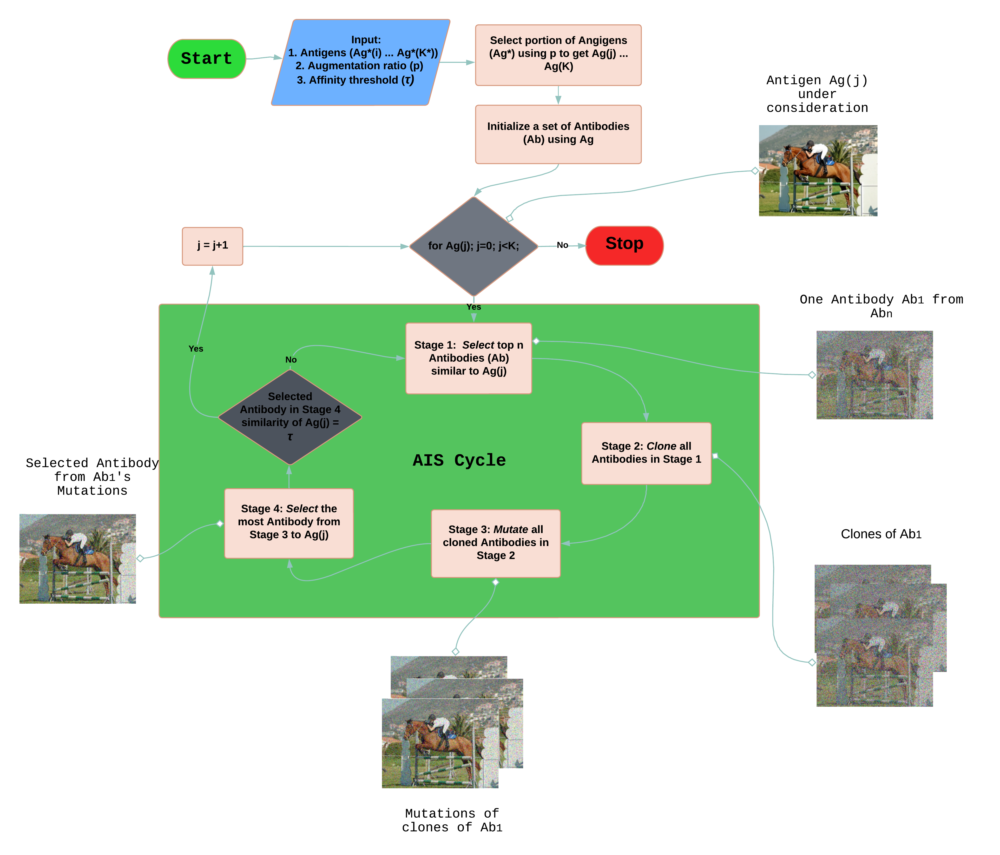

# [Artificial Immune Systems for data augmentation](https://www.techrxiv.org/articles/preprint/Defence_against_Image_Distortions_using_Artificial_Immune_Systems/24190293)
# Official implementation


## News

**`02-10-2023`**: The paper is available on [TechrXiv](https://www.techrxiv.org/articles/preprint/Defence_against_Image_Distortions_using_Artificial_Immune_Systems/24190293) now

**`02-10-2023`**: The pretrained YOLOv4 model is released

**`21-03-2024`**: The pretrained DINO model is released

## Installation

We provide an executable version of our code for given input images using our method. Just download and unzip to use our method.

### Run code on Windows
* Download code for Windows [here](https://drive.google.com/file/d/1awDgsXVG7j0Qnr35NyzYM2_3bTWNedOf/view?usp=drive_link)
* Place your training samples (antigens) following the augmented ratio in our paper in the "input" folder
* Double click on the excutable file
* Enter your desired affinity threshold and wait for antibodies to be generated into "output" folder
* Augment antibodies to your training samples and train your model. 

### Run on Linux
* Download code for Linux [here](https://drive.google.com/file/d/1OMGSsV5F9OIj8ijEhEaV7OkFeeQJWbQi/view?usp=drive_link)
* Place your training samples (antigens) following the augmented ratio in our paper in the "input" folder
* Double click on the excutable filein the "input" folder
* Open a terminal on the path the executable file is located
* Run this command ```chmod +x Exe_AISbod ```
* Run this command ```./Exe_AISbod"```
* Enter your desired affinity threshold and wait for antibodies to be generated into "output" folder


## Pretrain models

You can download pre-trained models of YOLOv4 using our method and other related works used in our paper.
* For PASCAL download weights [here](https://drive.google.com/drive/folders/1-8DJR3tC9bHC6OAwCEpzonL3WSUUhO0d?usp=sharing)
* For COCO download weights [here](https://drive.google.com/drive/folders/1QwG-4RNs8rmzsJ2ZgtSLgrcSJHLrduDp?usp=sharing)

You can download pre-trained models of DINO using our method [here] (https://drive.google.com/drive/folders/1SL3RrbVdYU_Es8iKsZUAjo21_2iyjM76?usp=drive_link)


## Citation
Please consider cite if our work is useful for your research:

```Bibtex
@article{Ofori-Oduro2023,
author = "Mark Ofori-Oduro and Maria Amer",
title = "{Defence against Image Distortions using Artificial Immune Systems}",
year = "2023",
month = "10",
url = "https://www.techrxiv.org/articles/preprint/Defence_against_Image_Distortions_using_Artificial_Immune_Systems/24190293",
doi = "10.36227/techrxiv.24190293.v1"
}
```

 DISCLAIMER:
This software is provided by the copyright holders and contributors "as is" and any express or implied warranties, including, but not  limited to, the implied warranties of merchantability and fitness for 
a particular purpose are disclaimed. In no event shall the Concordia University, Vidpro Lab members, or 
contributors be liable for any direct, indirect, incidental, special, exemplary, or consequential damages (including, but not limited to, procurement of substitute goods or services; loss of use, data, or 
profits; or business interruption) however caused and on any theory of liability, whether in contract, strict liability, or tort (including negligence or otherwise) arising in any way out of the use of this software, even if advised of the possibility of such damage.
